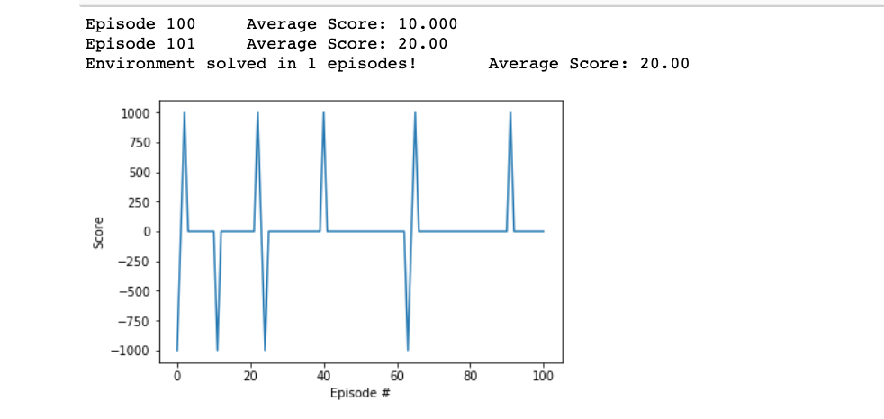

#Report

## Implimentation
I based my implementation off the code based of the Deep Learning Deep Q-networks lesson where we applied a DQN to the OpenAI gyrm to land an agent between two flags on the moon.

I adapted that code from the OpenAI gym LunarLanger environment to fit the the banana collector environment where the agent was tasked with collecting yellow bananas vs blue bananas.

Two main pieces of code were used from the OpenAI gym in this project:
* model.py:
    * This includes a pytorch deep neural network, this network is what is used to determine which actions the agent will take to get more rewards.

* dqn_agent.py:
    * This file includes two classes
        * Agent - Which Interacts with and learns from the environment.
        * ReplayBuffer(used in the Agent Class's init method) - A Fixed-size buffer to store experience tuples including:
            * state
            * action
            * reward
            * next_state
            * done

* We then used a Jupter notebook to put everything together to train the agent in the enviorment. This is where we modified the code to work with the Banana Collector enviorment instead of the LunarLander. Here we modified where the action, next_state, reward, and done variables came from.

## Learning Algorithm
The learning Algorithm used was the Deep Q Learning Algorithm which combined reinforcement learning with a deep nueral network.

Two main processes go on within the Algorith.

1. Sample the enviorment by performing actions and then store away the experience tuples in a memory.

2. Select small batch of tuples from the ones store in the memory from process 1 and learn from that batch through gradient descent to find the least error.

The parameters used were:
BUFFER_SIZE = int(1e5)  # replay buffer size
BATCH_SIZE = 64         # minibatch size
GAMMA = 0.99            # discount factor
TAU = 1e-3              # for soft update of target parameters
LR = 5e-4               # learning rate
UPDATE_EVERY = 4        # how often to update the network

## Plot of Rewards
"Trained Agent"

## Ideas for Future Work
A couple of techniques that can be used to optimized our model that were discussed in the course are:

### Double DQN
"Deep Q-Learning tends to overestimate action values. Double Q-Learning has been shown to work well in practice to help with this."

### Prioritized Experience Replay
"Deep Q-Learning samples experience transitions uniformly from a replay memory. Prioritized experienced replay is based on the idea that the agent can learn more effectively from some transitions than from others, and the more important transitions should be sampled with higher probability."

### Dueling DQN
"Currently, in order to determine which states are (or are not) valuable, we have to estimate the corresponding action values for each action. However, by replacing the traditional Deep Q-Network (DQN) architecture with a dueling architecture, we can assess the value of each state, without having to learn the effect of each action."

### Other Techniques mentioned
* Reward Clipping
* error clipping
* dealing with terminal states
